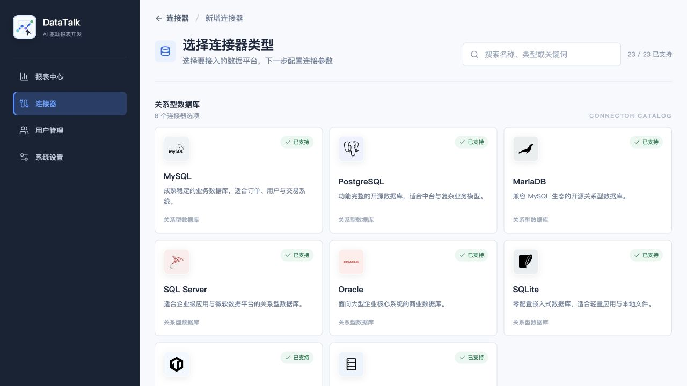

# DataTalk Studio

> 用对话完成报表开发。DataTalk Studio is an AI-native BI workspace for building, editing, validating, sharing, and reusing data reports.

DataTalk Studio 将传统 BI 中的数据源、指标、查询、可视化和报表编辑流程组织在一个工作区中。用户可以通过自然语言创建和修改报表，也可以在需要时进入可视化编辑器、数据源管理和指标知识管理等专业能力。

项目目前处于持续开发阶段。页面、API、数据模型和 Agent 工具接口可能发生变化，不建议在没有完成安全加固、权限审查和备份策略的情况下直接用于生产环境。

## 官网与企业服务

DataTalk Studio 是 DataTalk 的开源报表工作台。你可以先在官网浏览公开报告和模板，了解产品工作流，再进入 Studio 使用或二次开发：

- [访问 DataTalk 官网](https://datatalk.alenfive.top/?utm_source=github&utm_medium=readme&utm_campaign=datatalk-studio)：发现公开报告、数据模板、产品能力和应用场景。
- [浏览公开报告](https://datatalk.alenfive.top/reports?utm_source=github&utm_medium=readme&utm_campaign=datatalk-studio)：阅读数据故事、企业分析作品，并将可复用的报告复制到 Studio。
- [了解产品工作流](https://datatalk.alenfive.top/product?utm_source=github&utm_medium=readme&utm_campaign=datatalk-studio)：了解从连接数据、确认指标到生成和发布报告的完整流程。
- [查看应用场景](https://datatalk.alenfive.top/solutions?utm_source=github&utm_medium=readme&utm_campaign=datatalk-studio)：了解 DataTalk 在企业经营分析和行业场景中的应用方式。
- [在线进入 DataTalk Studio](https://studio.alenfive.top/?utm_source=github&utm_medium=readme&utm_campaign=datatalk-studio)：直接体验在线 Studio。

DataTalk 的官网和后续企业服务将围绕 `datatalk-web`、企业 SaaS 和私有化部署持续建设。开源仓库主要聚焦 Studio 的产品能力和工程实现；企业客户可通过[官网产品与应用场景页面](https://datatalk.alenfive.top/product?utm_source=github&utm_medium=readme&utm_campaign=datatalk-studio)了解最新服务形态、行业方案和部署选项。

## 界面预览

以下截图来自 DataTalk 官网展示的当前产品界面，帮助你在阅读代码和启动项目之前，先直观看到 Studio 的主要工作流：

<table>
  <tr>
    <th>新建连接器</th>
    <th>报告编辑工作台</th>
  </tr>
  <tr>
    <td>
      <a href="docs/screenshots/new-connector.png">
        
      </a>
    </td>
    <td>
      <a href="docs/screenshots/report-editor.png">
        
      </a>
    </td>
  </tr>
</table>

## 能力概览

- **对话式报表开发**：通过自然语言创建报表、调整指标、修改筛选条件、更新图表和编辑页面结构。
- **报表工作区**：支持报表草稿、预览、编辑、发布、回滚、公开链接和资源复用。
- **数据源接入**：包含面向 MySQL、PostgreSQL、SQLite、SQL Server、Oracle、MongoDB、Redis、ClickHouse、Databricks、BigQuery、Snowflake、Elasticsearch、Trino、DuckDB 以及 API/GraphQL 等场景的连接器入口；具体能力取决于对应适配器和运行环境。
- **指标知识**：支持指标定义、别名、公式、确认与反馈，用于提升自然语言分析的一致性和可复用性。
- **AI Agent 工具链**：为数据源发现、Schema 读取、SQL 预览、指标读取、指标提案、报表读取、预览检查、图像生成和 Web 搜索提供受控工具接口。
- **资源中心**：支持报表、模板和其他可复用资源的发布、发现、收藏、分类和复制。
- **多租户基础能力**：提供租户、成员、角色、会话和资源隔离的基础实现。
- **本地工作区存储**：报表工作文件、运行时状态、会话密钥和本地 SQLite 数据库默认放在项目目录之外的工作区目录中。
- **容器化部署**：提供基于 Next.js standalone output 的 Dockerfile 和镜像构建脚本。

## 技术栈

- Next.js 16 App Router
- React 19
- TypeScript
- Tailwind CSS
- SQLite（默认开发存储）或 MySQL（企业部署）
- Node.js 22.5.0 或更高版本
- 可选的集成 Agent Runtime 和外部模型服务

## 快速开始

### 环境要求

- Node.js `>=22.5.0`
- npm
- 如果使用 MySQL，需要一个可连接的 MySQL 8.x 或兼容实例

### 本地启动

```bash
git clone https://github.com/mihuajun/datatalk.git
cd datatalk
npm ci
npm run dev
```

开发服务器默认使用 Next.js 的 `3000` 端口。启动后访问：

```text
http://localhost:3000
```

首次启动时，如果没有配置完整的 MySQL 连接信息，应用会自动使用 SQLite。默认 SQLite 文件位于项目目录的上级工作区：

```text
../datatalk-workspace/chat-bi.sqlite
```

该路径不会被提交到 Git 仓库。

### 本地开发账号

开发环境初始化脚本会创建以下示例账号：

| 用户名 | 密码 | 用途 |
| --- | --- | --- |
| `admin` | `admin` | 管理员示例账号 |
| `dev` | `dev` | 开发者示例账号 |

这些账号仅用于本地开发。部署到共享环境或生产环境后，应立即修改或停用默认账号，并设置稳定的会话密钥。

### 可选：初始化示例数据

数据库会在应用启动时自动初始化基础结构。需要单独执行初始化或生成示例数据时，可以运行：

```bash
npm run db:init-members
npm run db:init-data-sources
npm run db:init-metric-knowledge
npm run db:init-reports
```

这些脚本会读取 `config/config.local.yaml`（如果存在）或 `config/config.yaml`。本地配置文件已加入 `.gitignore`，不要将真实数据库账号、密码、API Key 或客户数据写入可提交文件。

## 配置

默认配置模板位于 [config/config.yaml](config/config.yaml)。应用会优先读取未提交的本地配置文件：

```text
config/config.local.yaml
config/config.yaml
```

推荐使用环境变量配置敏感信息。最小开发配置不需要填写数据库变量；应用会回退到 SQLite。

### 常用环境变量

| 变量 | 默认值 | 说明 |
| --- | --- | --- |
| `WEB_APP_URL` | `http://localhost:3001` | 登录回跳和外部 Web 应用地址；单独运行 Studio 时可设为 Studio 地址 |
| `DATABASE_URL` | 空 | MySQL JDBC URL，例如 `jdbc:mysql://127.0.0.1:3306/datatalk_studio`；为空时使用 SQLite |
| `DATABASE_USERNAME` | 空 | MySQL 用户名；需要与 URL 和密码同时配置 |
| `DATABASE_PASSWORD` | 空 | MySQL 密码；不要写入仓库 |
| `SQLITE_DATABASE_PATH` | 工作区下的 `chat-bi.sqlite` | 覆盖 SQLite 文件路径，也可以设置为 `:memory:` |
| `WORKSPACE_STORAGE_ROOT` | 默认工作区路径 | 覆盖报表工作文件、运行时状态和本地数据库的存储根目录 |
| `AUTH_SESSION_SECRET` | 自动生成 | 多实例部署时应显式设置并在实例间保持一致 |
| `AUTH_COOKIE_DOMAIN` | 空 | 跨子域共享登录 Cookie 时设置 |
| `PUBLIC_LINK_SECRET` | 自动生成 | 公开链接访问 Cookie 的签名密钥；多实例部署时应保持一致 |
| `REPORT_AGENT_TOOL_SECRET` | 自动生成 | Agent 工具令牌签名密钥；多实例部署时应保持一致 |
| `REPORT_EDIT_LOCK_ENABLED` | `false` | 是否启用报表编辑锁 |
| `RESOURCE_CENTER_ENABLED` | `false` | 是否启用资源中心相关能力 |
| `AUTO_INIT_DATABASE` | 开启 | 设置为 `false`、`0` 或 `off` 可关闭启动时数据库初始化 |
| `WEB_SEARCH_API_KEY` | 空 | 可选的 Web 搜索能力凭据；不要提交到仓库 |
| `REPORT_AGENT_RUNTIME_PROXY_TOKEN` | 空 | 集成 Agent Runtime 代理时使用的内部令牌 |

示例：使用 MySQL 启动 Studio：

```bash
export WEB_APP_URL=http://localhost:3000
export DATABASE_URL='jdbc:mysql://127.0.0.1:3306/datatalk_studio?useUnicode=true&characterEncoding=UTF-8&serverTimezone=Asia/Shanghai'
export DATABASE_USERNAME=datatalk
export DATABASE_PASSWORD='change-me'
export AUTH_SESSION_SECRET='replace-with-a-long-random-value'

npm run dev
```

不要把上面的实际密码、生产域名、客户连接串或模型 API Key 写进 `config/config.yaml`、README、Issue 或提交记录。

## Docker 部署

构建镜像：

```bash
docker build -t datatalk:local .
```

使用持久化工作区启动：

```bash
docker run --rm \
  --name datatalk \
  -p 3000:3000 \
  -e WEB_APP_URL=http://localhost:3000 \
  -v datatalk-workspace:/app/workspace \
  datatalk:local
```

应用会在容器中的 `/app/workspace` 保存 SQLite 数据、报表工作文件、运行时状态和自动生成的密钥。生产部署时建议使用外部 MySQL、显式设置所有长期密钥，并为工作区配置备份和访问控制。

项目也提供 [build.sh](build.sh)，用于构建并推送到容器镜像仓库：

```bash
./build.sh --registry registry.example.com --name datatalk --tag latest
```

推送镜像前请通过环境变量提供仓库凭据，不要把凭据写入脚本或命令历史。

## 架构概览

```text
Browser
  │
  ▼
Next.js App Router
  ├── Auth / Tenant / Member APIs
  ├── Report Workspace and Editor
  ├── Data Source and Query APIs
  ├── Metric Knowledge and Evaluation APIs
  ├── Resource Center APIs
  └── Agent Tool APIs
        │
        ├── SQLite or MySQL
        ├── Workspace Storage
        ├── External Data Sources
        └── Integrated Agent Runtime / Model Provider
```

主要目录：

| 目录 | 内容 |
| --- | --- |
| `app/` | Next.js 页面和 API Route Handler |
| `components/` | 前端页面组件和交互组件 |
| `lib/server/` | 数据库、认证、报表、资源、Agent 和存储服务 |
| `config/` | 配置模板和本地配置入口 |
| `runtime-managed/` | 集成 Agent Runtime 的受控插件和运行时配置 |
| `scripts/` | 数据库初始化、构建辅助和验证脚本 |
| `skills/` | Agent 使用的技能、工具说明和资源 |
| `templates/` | 报表和工作区模板 |
| `docs/` | 产品和设计文档 |
| `public/` | 图标、连接器图标和静态资源 |

## 开发命令

```bash
# 启动开发服务器
npm run dev

# 生产构建
npm run build

# 启动生产构建
npm run start

# TypeScript 类型检查
npm run typecheck

# 运行验证脚本
npm run test:report-filters
npm run test:ai-artifacts
npm run test:report-editor-intent
npm run test:metric-knowledge
npm run test:image-gen
```

提交前建议至少执行：

```bash
npm run typecheck
npm run test:report-filters
npm run test:ai-artifacts
npm run test:report-editor-intent
npm run test:metric-knowledge
npm run test:image-gen
```

## 数据安全与生产注意事项

- 不要提交 `config/config.local.yaml`、`.env`、数据库文件、日志、运行时状态、私钥或模型凭据。
- 不要使用真实客户、患者、联系方式或其他敏感数据作为公开示例。
- 外部数据源建议使用只读账号，并根据租户和角色限制可访问的表、字段和操作。
- 生产环境必须替换本地默认账号和自动生成的开发密钥。
- 多实例部署时，需要在实例间共享稳定的 `AUTH_SESSION_SECRET`、`PUBLIC_LINK_SECRET` 和 `REPORT_AGENT_TOOL_SECRET`。
- Agent 工具具有数据访问能力时，应配置最小权限、查询审计、失败回滚和人工确认边界。
- 本项目目前处于积极开发阶段，生产使用前请自行完成安全评审、依赖审计、备份恢复演练和隐私合规审查。

## 开源协议

DataTalk Studio 使用 [Apache License 2.0](LICENSE)。第三方依赖和 `skills/` 下的扩展可能使用各自的许可证，请在分发前检查对应的许可证和归属声明。

## 参与贡献

欢迎通过 Issue 反馈问题、提出产品建议或提交 Pull Request。提交代码前请：

1. 确认改动不包含真实凭据、客户数据或内部配置。
2. 为可复现的行为变化补充验证脚本或测试。
3. 运行类型检查和相关验证命令。
4. 在 Pull Request 中说明影响范围、配置变化和迁移要求。
