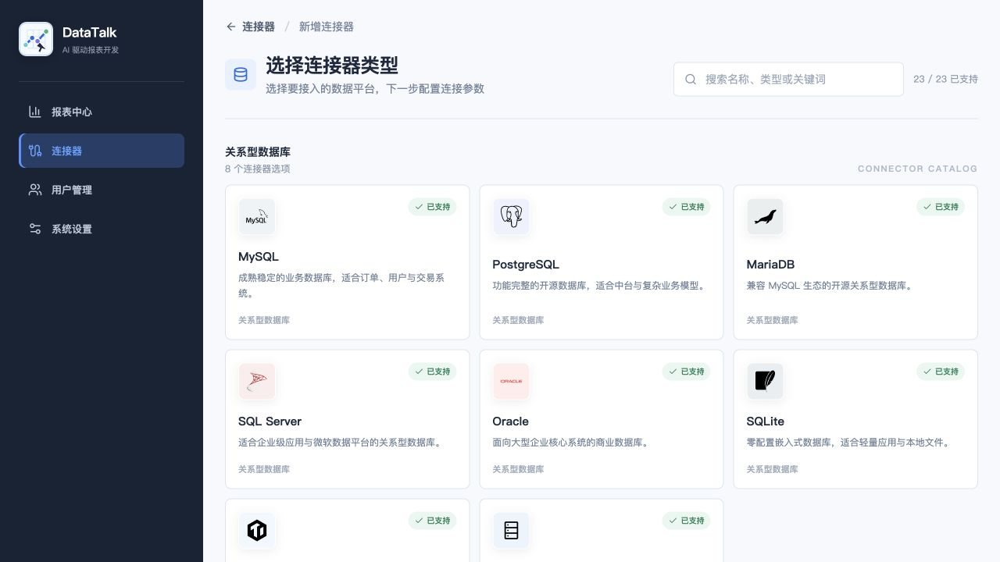

# DataTalk Studio

[中文](README.zh-CN.md) | **English**

> Build reports through conversation. DataTalk Studio is an AI-native BI workspace for building, editing, validating, sharing, and reusing data reports.

DataTalk Studio brings data sources, metrics, queries, visualizations, and report editing together in one workspace. Users can create and modify reports with natural language, or use the visual editor, data source management, and metric knowledge tools when professional control is needed.

## Website and Enterprise Services

DataTalk Studio is the open-source report workspace from DataTalk. Visit the website to explore public reports and templates before trying or extending Studio:

- [Visit the DataTalk website](https://datatalk.alenfive.top/?utm_source=github&utm_medium=readme&utm_campaign=datatalk-studio): Explore public reports, data templates, product capabilities, and use cases.
- [Browse public reports](https://datatalk.alenfive.top/reports?utm_source=github&utm_medium=readme&utm_campaign=datatalk-studio): Read data stories and reusable report examples.
- [Learn the product workflow](https://datatalk.alenfive.top/product?utm_source=github&utm_medium=readme&utm_campaign=datatalk-studio): See the workflow from connecting data and confirming metrics to generating and publishing reports.
- [View use cases](https://datatalk.alenfive.top/solutions?utm_source=github&utm_medium=readme&utm_campaign=datatalk-studio): Learn how DataTalk supports business and industry analytics.
- [Open DataTalk Studio online](https://studio.alenfive.top/?utm_source=github&utm_medium=readme&utm_campaign=datatalk-studio): Try the hosted Studio.

The DataTalk website and enterprise services are being developed around `datatalk-web`, enterprise SaaS, and private deployment offerings. This open-source repository focuses on Studio capabilities and engineering implementation.

## Screenshots

The following screenshots show the main Studio workflow:

<table>
  <tr>
    <th>New connector</th>
    <th>Report editor workspace</th>
  </tr>
  <tr>
    <td>
      <a href="docs/screenshots/new-connector.png">
        
      </a>
    </td>
    <td>
      <a href="docs/screenshots/report-editor.png">
        
      </a>
    </td>
  </tr>
</table>

## Capabilities

- **Conversational report development**: Create reports, adjust metrics, modify filters, update charts, and edit page structure with natural language.
- **Report workspace**: Draft, preview, edit, publish, roll back, share, and reuse reports.
- **Data source connections**: Connector entry points for MySQL, PostgreSQL, SQLite, SQL Server, Oracle, MongoDB, Redis, ClickHouse, Databricks, BigQuery, Snowflake, Elasticsearch, Trino, DuckDB, API, and GraphQL scenarios. Actual capabilities depend on adapters and runtime configuration.
- **Metric knowledge**: Define metrics, aliases, formulas, confirmations, and feedback to improve consistency and reuse in natural-language analysis.
- **AI Agent toolchain**: Controlled tools for data source discovery, schema reading, SQL previews, metric lookup, metric proposals, report reading, preview checks, image generation, and web search.
- **Resource Center**: Publish, discover, favorite, categorize, and copy reports, templates, and other reusable resources.
- **Multi-tenant foundations**: Basic tenant, member, role, session, and resource isolation.
- **Local workspace storage**: Report files, runtime state, session keys, and the local SQLite database are stored outside the project directory by default.
- **Container deployment**: Dockerfile and image build scripts based on Next.js standalone output.

## Tech Stack

- Next.js 16 App Router
- React 19
- TypeScript
- Tailwind CSS
- SQLite (default development storage) or MySQL (enterprise deployment)
- Node.js 22.5.0 or later
- Optional integrated Agent Runtime and external model services

## Quick Start

### Requirements

- Node.js `>=22.5.0`
- npm
- A reachable MySQL 8.x or compatible instance if MySQL is used

### Run Locally

```bash
git clone https://github.com/mihuajun/datatalk.git
cd datatalk
npm ci
npm run dev
```

The development server uses port `3000` by default. Open:

```text
http://localhost:3000
```

If complete MySQL settings are not provided on first launch, the application automatically uses SQLite. The default SQLite file is stored in the workspace directory:

```text
../datatalk-workspace/chat-bi.sqlite
```

This path is not committed to Git.

### Local Development Accounts

The development initialization script creates these example accounts:

| Username | Password | Purpose |
| --- | --- | --- |
| `admin` | `admin` | Administrator example |
| `dev` | `dev` | Developer example |

These accounts are for local development only. Change or disable them immediately in shared or production environments, and configure a stable session secret.

### Optional: Initialize Sample Data

The database initializes its base schema on application startup. To initialize specific data sets:

```bash
npm run db:init-members
npm run db:init-data-sources
npm run db:init-metric-knowledge
npm run db:init-reports
```

These scripts read `config/config.local.yaml` when present, otherwise `config/config.yaml`. Local configuration is ignored by Git. Never write real database credentials, API keys, or customer data to committed files.

## Configuration

The default configuration template is [config/config.yaml](config/config.yaml). The application prefers the uncommitted local configuration:

```text
config/config.local.yaml
config/config.yaml
```

Use environment variables for sensitive values. A minimal development setup does not require database variables; the application falls back to SQLite.

### Common Environment Variables

| Variable | Default | Description |
| --- | --- | --- |
| `WEB_APP_URL` | `http://localhost:3001` | Login redirect and external web application URL |
| `DATABASE_URL` | Empty | MySQL JDBC URL; empty uses SQLite |
| `DATABASE_USERNAME` | Empty | MySQL username |
| `DATABASE_PASSWORD` | Empty | MySQL password; never commit it |
| `SQLITE_DATABASE_PATH` | `chat-bi.sqlite` in the workspace | Override the SQLite file path; `:memory:` is also supported |
| `WORKSPACE_STORAGE_ROOT` | Default workspace path | Override report, runtime, and local database storage |
| `AUTH_SESSION_SECRET` | Auto-generated | Set explicitly and keep consistent across instances |
| `AUTH_COOKIE_DOMAIN` | Empty | Cookie domain for cross-subdomain sessions |
| `PUBLIC_LINK_SECRET` | Auto-generated | Signing secret for public-link access cookies |
| `REPORT_AGENT_TOOL_SECRET` | Auto-generated | Signing secret for Agent tool tokens |
| `REPORT_EDIT_LOCK_ENABLED` | `false` | Enable report edit locks |
| `RESOURCE_CENTER_ENABLED` | `false` | Enable Resource Center capabilities |
| `AUTO_INIT_DATABASE` | Enabled | Set to `false`, `0`, or `off` to disable startup initialization |
| `WEB_SEARCH_API_KEY` | Empty | Optional web search credential; never commit it |
| `REPORT_AGENT_RUNTIME_PROXY_TOKEN` | Empty | Internal token for the integrated Agent Runtime proxy |

Example: run Studio with MySQL:

```bash
export WEB_APP_URL=http://localhost:3000
export DATABASE_URL='jdbc:mysql://127.0.0.1:3306/datatalk_studio?useUnicode=true&characterEncoding=UTF-8&serverTimezone=Asia/Shanghai'
export DATABASE_USERNAME=datatalk
export DATABASE_PASSWORD='change-me'
export AUTH_SESSION_SECRET='replace-with-a-long-random-value'

npm run dev
```

Never place actual passwords, production domains, customer connection strings, or model API keys in `config/config.yaml`, the README, issues, or commits.

## Docker Deployment

Build the image:

```bash
docker build -t datatalk:local .
```

Run with a persistent workspace:

```bash
docker run --rm \
  --name datatalk \
  -p 3000:3000 \
  -e WEB_APP_URL=http://localhost:3000 \
  -v datatalk-workspace:/app/workspace \
  datatalk:local
```

The container stores SQLite data, report files, runtime state, and generated secrets in `/app/workspace`. For production, use external MySQL, set all long-lived secrets explicitly, and configure backups and access control for the workspace.

The project also provides [build.sh](build.sh) for building and pushing an image:

```bash
./build.sh --registry registry.example.com --name datatalk --tag latest
```

Provide registry credentials through environment variables. Do not put them in scripts or shell history.

## Architecture

```text
Browser
  │
  ▼
Next.js App Router
  ├── Auth / Tenant / Member APIs
  ├── Report Workspace and Editor
  ├── Data Source and Query APIs
  ├── Metric Knowledge and Evaluation APIs
  ├── Resource Center APIs
  └── Agent Tool APIs
        │
        ├── SQLite or MySQL
        ├── Workspace Storage
        ├── External Data Sources
        └── Integrated Agent Runtime / Model Provider
```

Key directories:

| Directory | Contents |
| --- | --- |
| `app/` | Next.js pages and API Route Handlers |
| `components/` | Frontend page and interaction components |
| `lib/server/` | Database, auth, report, resource, Agent, and storage services |
| `config/` | Configuration templates and local configuration entry points |
| `runtime-managed/` | Controlled plugins and runtime configuration for the integrated Agent Runtime |
| `scripts/` | Database initialization, build helpers, and verification scripts |
| `skills/` | Agent skills, tool instructions, and resources |
| `templates/` | Report and workspace templates |
| `docs/` | Product and design documentation |
| `public/` | Icons, connector icons, and static assets |

## Development Commands

```bash
# Start the development server
npm run dev

# Create a production build
npm run build

# Start the production build
npm run start

# TypeScript type checking
npm run typecheck

# Run verification scripts
npm run test:report-filters
npm run test:ai-artifacts
npm run test:report-editor-intent
npm run test:metric-knowledge
npm run test:image-gen
```

Before submitting changes, run at least:

```bash
npm run typecheck
npm run test:report-filters
npm run test:ai-artifacts
npm run test:report-editor-intent
npm run test:metric-knowledge
npm run test:image-gen
```

## License

DataTalk Studio is released under the [Apache License 2.0](LICENSE). Extensions under `skills/` and third-party dependencies may have their own licenses; review the relevant notices before redistribution.

## Contributing

Issues, product suggestions, and pull requests are welcome. Before submitting code:

1. Confirm that the change contains no real credentials, customer data, or internal configuration.
2. Add a verification script or test for reproducible behavior changes.
3. Run type checking and relevant verification commands.
4. Describe the impact, configuration changes, and migration requirements in the pull request.
